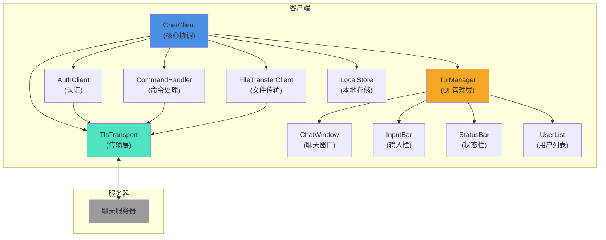
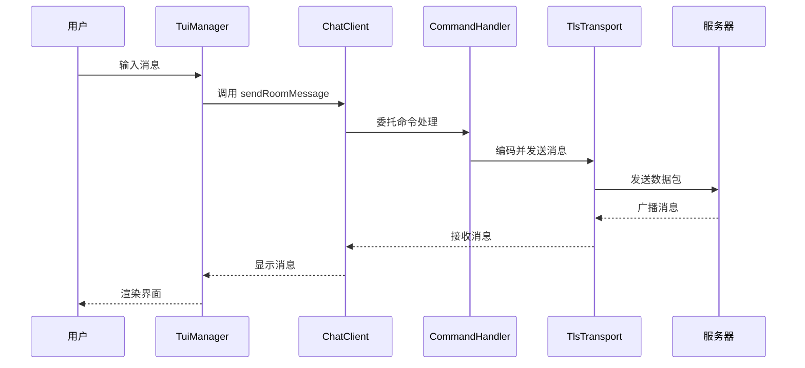
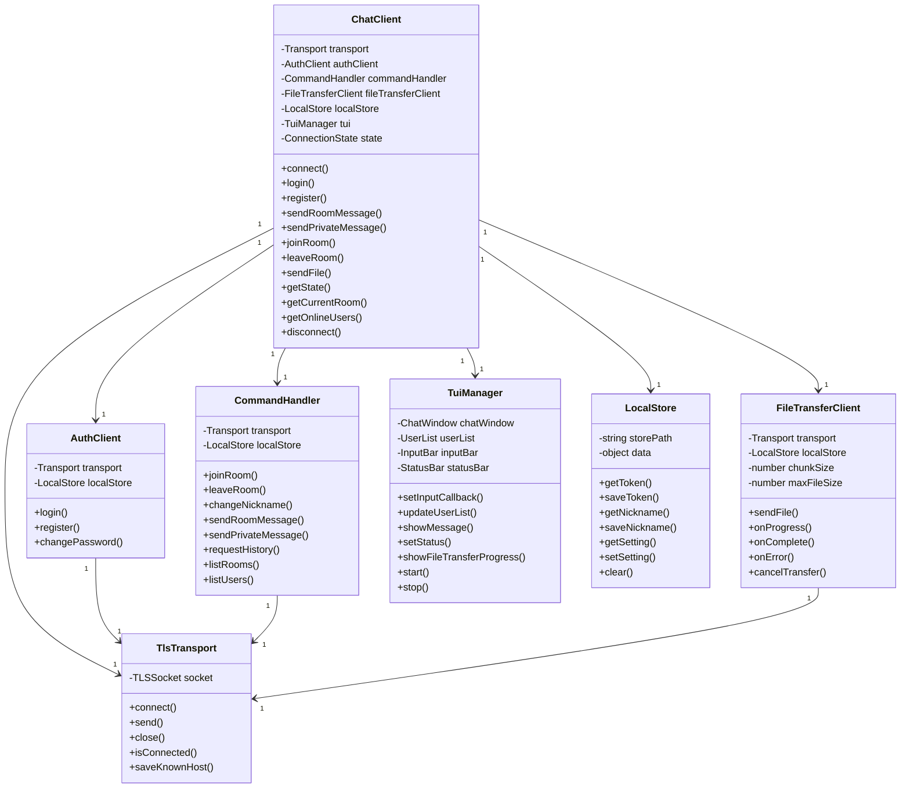

# LanChat CLI 客户端 API 文档

## 目录
- [模块概述](#模块概述)
- [架构说明](#架构说明)
- [核心类 API](#核心类-api)
  - [ChatClient](#chatclient)
  - [AuthClient](#authclient)
  - [CommandHandler](#commandhandler)
  - [FileTransferClient](#filetransferclient)
  - [TuiManager](#tuimanager)
  - [Transport 接口和 TlsTransport](#transport-接口和-tlstransport)
- [TUI 组件文档](#tui-组件文档)
  - [ChatWindow](#chatwindow-1)
  - [InputBar](#inputbar-1)
  - [StatusBar](#statusbar-1)
  - [UserList](#userlist-1)
- [工具类文档](#工具类文档)
  - [LocalStore](#localstore)
- [使用示例](#使用示例)
- [架构图](#架构图)

---

## 模块概述

LanChat CLI 客户端是一个基于 Node.js 的命令行聊天应用程序，支持以下功能：

- 用户认证（登录、注册、密码修改）
- 聊天室管理（加入、离开、房间列表）
- 群聊和私聊消息
- 文件传输（支持大文件分块传输）
- 终端用户界面（TUI）
- 安全的 TLS 加密通信

### 技术栈
- TypeScript
- Node.js
- Blessed（TUI 库）
- TLS/SSL（安全传输）
- 事件驱动架构

---

## 架构说明

客户端采用模块化设计，主要包含以下层次：

1. **传输层**：负责底层网络通信，支持 TLS 加密
2. **业务逻辑层**：处理聊天、认证、文件传输等核心功能
3. **UI 层**：终端用户界面组件
4. **工具层**：本地存储等辅助功能

各模块通过事件驱动方式协作，实现松耦合的架构设计。

---

## 核心类 API

### ChatClient

聊天客户端核心类，负责协调所有子模块并管理客户端状态。

#### 构造函数

```typescript
constructor()
```

初始化聊天客户端，创建传输层、认证客户端、命令处理器、文件传输客户端和本地存储实例。

#### 属性

| 属性 | 类型 | 说明 |
|------|------|------|
| `state` | `ConnectionState` | 当前连接状态 |
| `currentRoom` | `string` | 当前所在房间 |
| `onlineUsers` | `OnlineUser[]` | 当前房间的在线用户列表 |

#### 方法

##### connect
```typescript
async connect(host: string, port: number): Promise<void>
```
连接到聊天服务器。

**参数：**
- `host` - 服务器主机地址
- `port` - 服务器端口号

**示例：**
```typescript
await client.connect('localhost', 9527);
```

##### login
```typescript
async login(nickname: string, password: string): Promise<void>
```
用户登录。

**参数：**
- `nickname` - 用户昵称
- `password` - 用户密码

##### register
```typescript
async register(nickname: string, password: string): Promise<void>
```
用户注册。

**参数：**
- `nickname` - 选择的昵称
- `password` - 设置的密码

##### sendRoomMessage
```typescript
async sendRoomMessage(text: string): Promise<void>
```
发送群聊消息到当前房间。

**参数：**
- `text` - 消息内容

##### sendPrivateMessage
```typescript
async sendPrivateMessage(target: string, text: string): Promise<void>
```
发送私聊消息。

**参数：**
- `target` - 目标用户昵称
- `text` - 消息内容

##### joinRoom
```typescript
async joinRoom(roomName: string): Promise<void>
```
加入指定聊天室。

**参数：**
- `roomName` - 房间名称

##### leaveRoom
```typescript
async leaveRoom(): Promise<void>
```
离开当前聊天室。

##### changeNickname
```typescript
async changeNickname(newNickname: string): Promise<void>
```
修改用户昵称。

**参数：**
- `newNickname` - 新昵称

##### requestHistory
```typescript
async requestHistory(count: number = 50): Promise<void>
```
请求聊天历史记录。

**参数：**
- `count` - 要获取的消息数量（默认 50，最大 200）

##### sendFile
```typescript
async sendFile(target: string, filePath: string): Promise<void>
```
发送文件。

**参数：**
- `target` - 目标用户昵称
- `filePath` - 文件路径

**抛出：**
- 文件不存在或大小超限时抛出错误

##### getState
```typescript
getState(): ConnectionState
```
获取当前连接状态。

**返回：** 当前连接状态

##### getCurrentRoom
```typescript
getCurrentRoom(): string
```
获取当前所在房间。

**返回：** 当前房间名称

##### getOnlineUsers
```typescript
getOnlineUsers(): OnlineUser[]
```
获取当前房间的在线用户列表。

**返回：** 在线用户数组

##### disconnect
```typescript
async disconnect(): Promise<void>
```
断开与服务器的连接。

##### setTui
```typescript
setTui(tui: TuiManager): void
```
设置 TUI 管理器。

**参数：**
- `tui` - TUI 管理器实例

#### 事件

| 事件名 | 参数 | 说明 |
|--------|------|------|
| `connect` | - | 连接成功 |
| `close` | - | 连接关闭 |
| `error` | `error: Error` | 发生错误 |
| `authenticated` | - | 认证成功 |
| `message` | `message` | 收到消息 |

#### ConnectionState 枚举

```typescript
enum ConnectionState {
  Disconnected = 'Disconnected',
  Connecting = 'Connecting',
  Connected = 'Connected',
  Authenticated = 'Authenticated',
  Reconnecting = 'Reconnecting'
}
```

---

### AuthClient

认证客户端类，负责处理用户认证相关操作。

#### 构造函数

```typescript
constructor(transport: Transport)
```

**参数：**
- `transport` - 传输层实例

#### 方法

##### login
```typescript
async login(nickname: string, password: string): Promise<void>
```
用户登录。

**参数：**
- `nickname` - 用户昵称
- `password` - 用户密码

##### register
```typescript
async register(nickname: string, password: string): Promise<void>
```
用户注册。

**参数：**
- `nickname` - 选择的昵称
- `password` - 设置的密码

##### changePassword
```typescript
async changePassword(oldPassword: string, newPassword: string): Promise<void>
```
修改密码。

**参数：**
- `oldPassword` - 旧密码
- `newPassword` - 新密码

---

### CommandHandler

命令处理器类，负责处理各种聊天命令。

#### 构造函数

```typescript
constructor(transport: Transport)
```

**参数：**
- `transport` - 传输层实例

#### 方法

##### joinRoom
```typescript
async joinRoom(roomName: string): Promise<void>
```
加入聊天室。

**参数：**
- `roomName` - 房间名称

##### leaveRoom
```typescript
async leaveRoom(roomName: string): Promise<void>
```
离开聊天室。

**参数：**
- `roomName` - 房间名称

##### changeNickname
```typescript
async changeNickname(newNickname: string): Promise<void>
```
修改用户昵称。

**参数：**
- `newNickname` - 新昵称

##### sendRoomMessage
```typescript
async sendRoomMessage(roomName: string, text: string): Promise<void>
```
发送群聊消息。

**参数：**
- `roomName` - 目标房间名称
- `text` - 消息内容

##### sendPrivateMessage
```typescript
async sendPrivateMessage(targetNickname: string, text: string): Promise<void>
```
发送私聊消息。

**参数：**
- `targetNickname` - 目标用户昵称
- `text` - 消息内容

##### requestHistory
```typescript
async requestHistory(roomName: string, count: number = 50): Promise<void>
```
请求聊天历史记录。

**参数：**
- `roomName` - 房间名称
- `count` - 要获取的消息数量（默认 50，最大 200）

##### requestPrivateHistory
```typescript
async requestPrivateHistory(targetNickname: string, count: number = 50): Promise<void>
```
请求私聊历史记录。

**参数：**
- `targetNickname` - 目标用户昵称
- `count` - 要获取的消息数量（默认 50，最大 200）

##### listRooms
```typescript
async listRooms(): Promise<void>
```
获取房间列表。

##### listUsers
```typescript
async listUsers(roomName: string): Promise<void>
```
获取房间用户列表。

**参数：**
- `roomName` - 房间名称

---

### FileTransferClient

文件传输客户端类，负责处理文件传输功能。

#### 构造函数

```typescript
constructor(transport: Transport)
```

**参数：**
- `transport` - 传输层实例

#### 属性

| 属性 | 类型 | 说明 |
|------|------|------|
| `chunkSize` | `number` | 文件块大小（默认 64KB） |
| `maxFileSize` | `number` | 最大文件大小（默认 500MB） |

#### 方法

##### sendFile
```typescript
async sendFile(targetNickname: string, filePath: string): Promise<void>
```
发送文件。

**参数：**
- `targetNickname` - 目标用户昵称
- `filePath` - 要发送的文件路径

**抛出：**
- 文件不存在或大小超限时抛出错误

##### onProgress
```typescript
onProgress(callback: ProgressCallback): void
```
设置进度回调。

**参数：**
- `callback` - 进度更新回调函数，签名为 `(bytesTransferred: number, totalBytes: number) => void`

##### onComplete
```typescript
onComplete(callback: CompleteCallback): void
```
设置完成回调。

**参数：**
- `callback` - 传输完成回调函数，签名为 `(filePath: string, success: boolean) => void`

##### onError
```typescript
onError(callback: ErrorCallback): void
```
设置错误回调。

**参数：**
- `callback` - 错误发生回调函数，签名为 `(error: Error) => void`

##### cancelTransfer
```typescript
cancelTransfer(fileId: string): void
```
取消文件传输。

**参数：**
- `fileId` - 文件传输 ID

##### handleFileResponse
```typescript
handleFileResponse(payload: Buffer): void
```
处理文件响应。

**参数：**
- `payload` - 响应数据

##### handleFileChunk
```typescript
handleFileChunk(payload: Buffer): void
```
处理文件数据块。

**参数：**
- `payload` - 文件块数据

##### handleFileEnd
```typescript
handleFileEnd(payload: Buffer): void
```
处理文件传输结束。

**参数：**
- `payload` - 结束数据

##### handleFileProgress
```typescript
handleFileProgress(payload: Buffer): void
```
处理文件传输进度更新。

**参数：**
- `payload` - 进度数据

---

### TuiManager

TUI 管理器类，管理终端用户界面的各个组件。

#### 构造函数

```typescript
constructor()
```

初始化所有 UI 组件并设置基础布局。

#### 方法

##### setInputCallback
```typescript
setInputCallback(callback: (text: string) => void): void
```
设置输入回调。

**参数：**
- `callback` - 输入提交时的回调函数

##### updateUserList
```typescript
updateUserList(users: OnlineUser[]): void
```
更新用户列表显示。

**参数：**
- `users` - 用户列表

##### updateRoomList
```typescript
updateRoomList(rooms: RoomInfo[]): void
```
更新房间列表显示。

**参数：**
- `rooms` - 房间列表

##### showMessage
```typescript
showMessage(message: MessageData): void
```
显示消息。

**参数：**
- `message` - 消息对象

**MessageData 类型：**
```typescript
type MessageData = {
  type: string;
  sender?: string;
  content: string;
  timestamp: string;
  room?: string;
}
```

##### setStatus
```typescript
setStatus(status: string): void
```
更新连接状态。

**参数：**
- `status` - 状态文本

##### showFileTransferProgress
```typescript
showFileTransferProgress(progress: number): void
```
显示文件传输进度。

**参数：**
- `progress` - 进度百分比 (0-100)

##### render
```typescript
render(): void
```
渲染界面。

##### start
```typescript
start(): void
```
启动 TUI，开始渲染界面并设置焦点。

##### stop
```typescript
stop(): void
```
停止 TUI，停止界面渲染并清理资源。

##### destroy
```typescript
destroy(): void
```
销毁 TUI。

##### appendMessage
```typescript
appendMessage(message: MessageData): void
```
添加消息到聊天窗口。

**参数：**
- `message` - 消息对象

---

### Transport 接口和 TlsTransport

#### ITransport 接口

传输层接口定义，定义客户端与服务端通信的传输层抽象。

##### 方法

###### connect
```typescript
async connect(host: string, port: number): Promise<void>
```
连接到服务器。

**参数：**
- `host` - 服务器主机地址
- `port` - 服务器端口号

**抛出：**
- 连接失败时抛出错误

###### send
```typescript
send(data: Buffer): void
```
发送数据。

**参数：**
- `data` - 要发送的数据缓冲区

###### close
```typescript
close(): void
```
关闭连接。

###### isConnected
```typescript
isConnected(): boolean
```
检查是否已连接。

**返回：** 如果已连接返回 true

##### 事件

| 事件名 | 参数 | 说明 |
|--------|------|------|
| `connect` | - | 连接成功 |
| `close` | - | 连接关闭 |
| `message` | `data: Buffer` | 收到消息 |
| `error` | `error: Error` | 发生错误 |

#### BaseTransport 类

基础传输层类，提供传输层的基础实现框架。

#### TlsTransport 类

基于 TLS/SSL 的安全传输层实现。

##### 构造函数

```typescript
constructor()
```

初始化 TLS 传输层，设置已知主机存储路径。

##### 方法

###### connect
```typescript
async connect(host: string, port: number): Promise<void>
```
连接到 TLS 服务器。

**参数：**
- `host` - 服务器主机地址
- `port` - 服务器端口号

**抛出：**
- 连接失败或 TLS 握手失败时抛出错误

###### send
```typescript
send(data: Buffer): void
```
发送数据。

**参数：**
- `data` - 要发送的数据缓冲区

###### close
```typescript
close(): void
```
关闭连接，销毁 TLS 连接并清理资源。

###### isConnected
```typescript
isConnected(): boolean
```
检查连接状态。

**返回：** 如果已连接返回 true

###### saveKnownHost
```typescript
saveKnownHost(): void
```
保存已知主机，将当前服务器证书指纹保存到已知主机列表。

###### onMessage
```typescript
onMessage(callback: (data: Buffer) => void): void
```
设置消息处理回调。

**参数：**
- `callback` - 消息回调函数

###### onClose
```typescript
onClose(callback: () => void): void
```
设置连接关闭回调。

**参数：**
- `callback` - 关闭回调函数

###### onError
```typescript
onError(callback: (error: Error) => void): void
```
设置错误处理回调。

**参数：**
- `callback` - 错误回调函数

###### onConnect
```typescript
onConnect(callback: () => void): void
```
设置连接成功回调。

**参数：**
- `callback` - 连接回调函数

---

## TUI 组件文档

### ChatWindow

聊天消息窗口组件，显示聊天消息。

#### 构造函数

```typescript
constructor()
```

#### 方法

##### appendTo
```typescript
appendTo(parent: Widgets.BoxElement): void
```
将组件添加到父容器。

**参数：**
- `parent` - 父容器元素

##### appendMessage
```typescript
appendMessage(message: MessageData): void
```
添加消息到聊天窗口。

**参数：**
- `message` - 消息对象

##### setTitle
```typescript
setTitle(title: string): void
```
设置窗口标题。

**参数：**
- `title` - 标题文本

##### clear
```typescript
clear(): void
```
清空聊天窗口。

##### getContainer
```typescript
getContainer(): Widgets.BoxElement
```
获取容器元素。

**返回：** 容器元素

---

### InputBar

输入栏组件，用户输入消息和命令的文本框。

#### 构造函数

```typescript
constructor()
```

#### 方法

##### appendTo
```typescript
appendTo(parent: Widgets.BoxElement): void
```
将组件添加到父容器。

**参数：**
- `parent` - 父容器元素

##### onSubmit
```typescript
onSubmit(callback: (text: string) => void): void
```
设置提交回调。

**参数：**
- `callback` - 提交回调函数

##### focus
```typescript
focus(): void
```
设置焦点到输入框。

##### clear
```typescript
clear(): void
```
清空输入框。

##### setCompletions
```typescript
setCompletions(completions: string[]): void
```
设置自动补全项。

**参数：**
- `completions` - 补全项数组

##### getInput
```typescript
getInput(): Widgets.TextboxElement
```
获取输入框元素。

**返回：** 输入框元素

---

### StatusBar

状态栏组件，显示连接状态和文件传输进度。

#### 构造函数

```typescript
constructor()
```

#### 方法

##### attachTo
```typescript
attachTo(screen: blessed.Widgets.Screen): void
```
将组件附加到屏幕。

**参数：**
- `screen` - 屏幕实例

##### setStatus
```typescript
setStatus(status: string): void
```
设置状态文本。

**参数：**
- `status` - 状态文本

##### setFileTransfer
```typescript
setFileTransfer(progress: number): void
```
设置文件传输进度。

**参数：**
- `progress` - 进度百分比 (0-100)

##### getContainer
```typescript
getContainer(): Widgets.BoxElement
```
获取容器元素。

**返回：** 容器元素

---

### UserList

用户列表组件，显示当前房间的在线用户列表。

#### 构造函数

```typescript
constructor()
```

#### 方法

##### attachTo
```typescript
attachTo(screen: blessed.Widgets.Screen): void
```
将组件附加到屏幕。

**参数：**
- `screen` - 屏幕实例

##### update
```typescript
update(users: Array<{ nickname: string; userId: number }>): void
```
更新用户列表。

**参数：**
- `users` - 用户数组

##### getContainer
```typescript
getContainer(): Widgets.BoxElement
```
获取容器元素。

**返回：** 容器元素

---

## 工具类文档

### LocalStore

本地存储管理器，管理客户端本地配置数据。

#### 构造函数

```typescript
constructor()
```

#### 方法

##### getToken
```typescript
getToken(): string | undefined
```
获取认证令牌。

**返回：** 令牌字符串，如果不存在返回 undefined

##### saveToken
```typescript
saveToken(token: string): void
```
保存认证令牌。

**参数：**
- `token` - 令牌字符串

##### getNickname
```typescript
getNickname(): string | undefined
```
获取用户昵称。

**返回：** 昵称字符串，如果不存在返回 undefined

##### saveNickname
```typescript
saveNickname(nickname: string): void
```
保存用户昵称。

**参数：**
- `nickname` - 昵称字符串

##### clearToken
```typescript
clearToken(): void
```
清除认证令牌。

##### getKnownHost
```typescript
getKnownHost(host: string): string | undefined
```
获取已知主机指纹。

**参数：**
- `host` - 主机标识

**返回：** 指纹字符串，如果不存在返回 undefined

##### saveKnownHost
```typescript
saveKnownHost(host: string, fingerprint: string): void
```
保存已知主机指纹。

**参数：**
- `host` - 主机标识
- `fingerprint` - 指纹字符串

##### removeKnownHost
```typescript
removeKnownHost(host: string): void
```
移除已知主机。

**参数：**
- `host` - 主机标识

##### getSetting
```typescript
getSetting<T>(key: string, defaultValue: T): T
```
获取设置项。

**参数：**
- `key` - 设置键
- `defaultValue` - 默认值

**返回：** 设置值

##### setSetting
```typescript
setSetting<T>(key: string, value: T): void
```
设置设置项。

**参数：**
- `key` - 设置键
- `value` - 设置值

##### clear
```typescript
clear(): void
```
清空所有存储数据。

---

## 使用示例

### 基本用法

```typescript
import { ChatClient, TuiManager } from './client';

// 创建聊天客户端
const client = new ChatClient();

// 创建并设置 TUI
const tui = new TuiManager();
client.setTui(tui);

// 监听事件
client.on('message', (message) => {
  tui.showMessage(message);
});

client.on('error', (error) => {
  console.error('错误:', error.message);
});

client.on('authenticated', () => {
  tui.setStatus('已登录');
});

// 设置输入回调
tui.setInputCallback(async (text) => {
  if (text.startsWith('/')) {
    // 处理命令
    const parts = text.split(' ');
    const command = parts[0];
    
    switch (command) {
      case '/join':
        await client.joinRoom(parts[1]);
        break;
      case '/leave':
        await client.leaveRoom();
        break;
      case '/msg':
        await client.sendPrivateMessage(parts[1], parts.slice(2).join(' '));
        break;
      case '/nick':
        await client.changeNickname(parts[1]);
        break;
      case '/file':
        await client.sendFile(parts[1], parts[2]);
        break;
      default:
        break;
    }
  } else {
    // 发送普通消息
    await client.sendRoomMessage(text);
  }
});

// 连接并登录
async function main() {
  try {
    tui.setStatus('连接中...');
    await client.connect('localhost', 9527);
    tui.setStatus('连接成功');
    
    tui.setStatus('登录中...');
    await client.login('myusername', 'mypassword');
    
    tui.start();
  } catch (error) {
    console.error('启动失败:', error);
  }
}

main();
```

### 无 TUI 用法

```typescript
import { ChatClient } from './client';

const client = new ChatClient();

client.on('message', (message) => {
  console.log(`[${message.type}] ${message.sender || '系统'}: ${message.content}`);
});

client.on('error', (error) => {
  console.error('错误:', error.message);
});

async function main() {
  await client.connect('localhost', 9527);
  await client.login('user', 'pass');
  await client.joinRoom('#general');
  await client.sendRoomMessage('大家好！');
}

main();
```

### 文件传输示例

```typescript
import { ChatClient } from './client';

const client = new ChatClient();

async function sendFileExample() {
  await client.connect('localhost', 9527);
  await client.login('user', 'pass');
  
  const fileTransfer = client['fileTransferClient'];
  
  fileTransfer.onProgress((sent, total) => {
    const progress = Math.round((sent / total) * 100);
    console.log(`传输进度: ${progress}%`);
  });
  
  fileTransfer.onComplete((filePath, success) => {
    if (success) {
      console.log(`文件 ${filePath} 传输成功`);
    } else {
      console.log(`文件传输失败`);
    }
  });
  
  fileTransfer.onError((error) => {
    console.error('文件传输错误:', error.message);
  });
  
  await client.sendFile('recipient', '/path/to/file.pdf');
}
```

### 仅使用传输层示例

```typescript
import { TlsTransport, MessageCodec, MessageType } from './client';

const transport = new TlsTransport();

transport.on('connect', () => {
  console.log('连接成功');
  const message = MessageCodec.encodeJson(MessageType.ROOM_LIST, {});
  transport.send(message);
});

transport.on('message', (data) => {
  const decoded = MessageCodec.decode(data);
  console.log('收到消息:', decoded);
});

transport.on('error', (error) => {
  console.error('错误:', error.message);
});

transport.connect('localhost', 9527);
```

---

## 架构图



### 消息流程图



### 组件关系图



---

## 更新日志

### v1.0.0
- 初始版本发布
- 实现核心聊天功能
- 支持用户认证
- 支持文件传输
- 实现 TUI 界面
