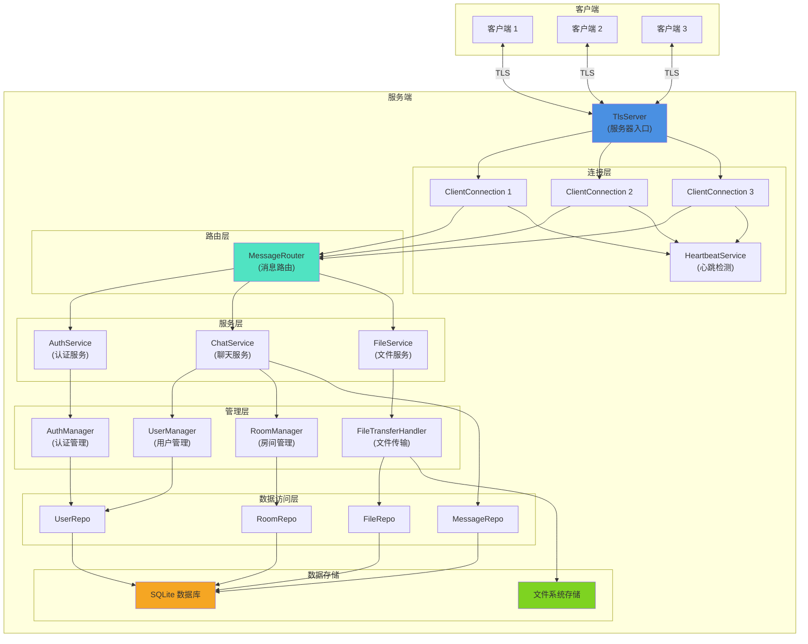
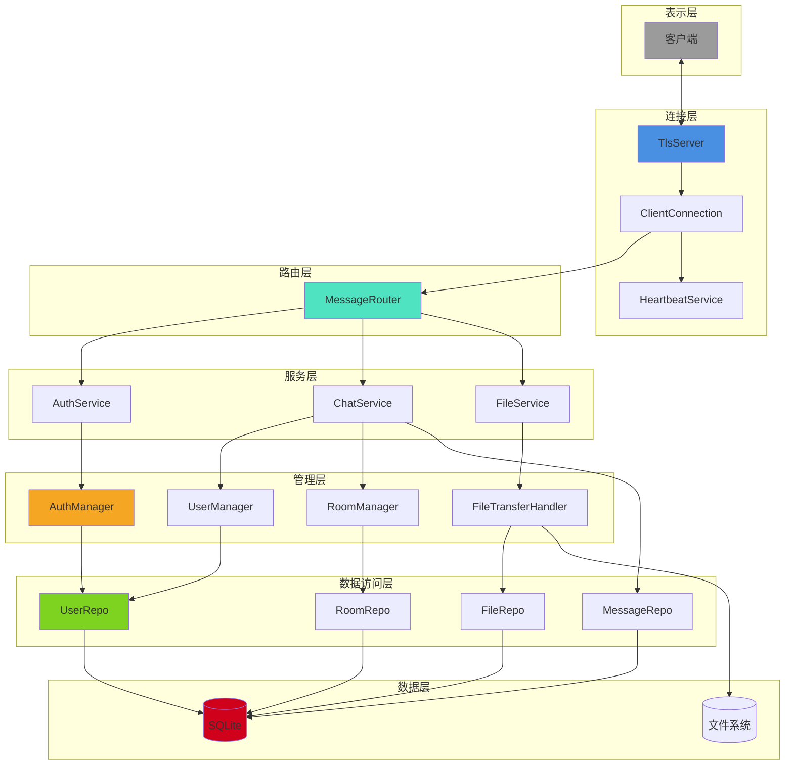
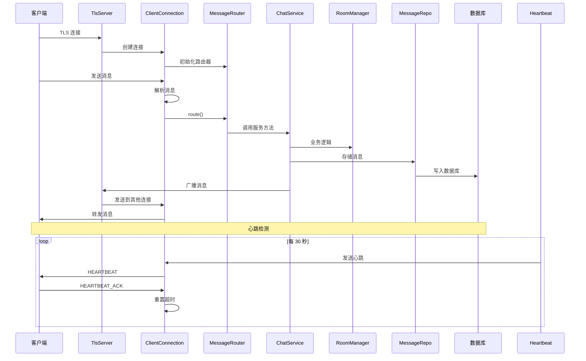
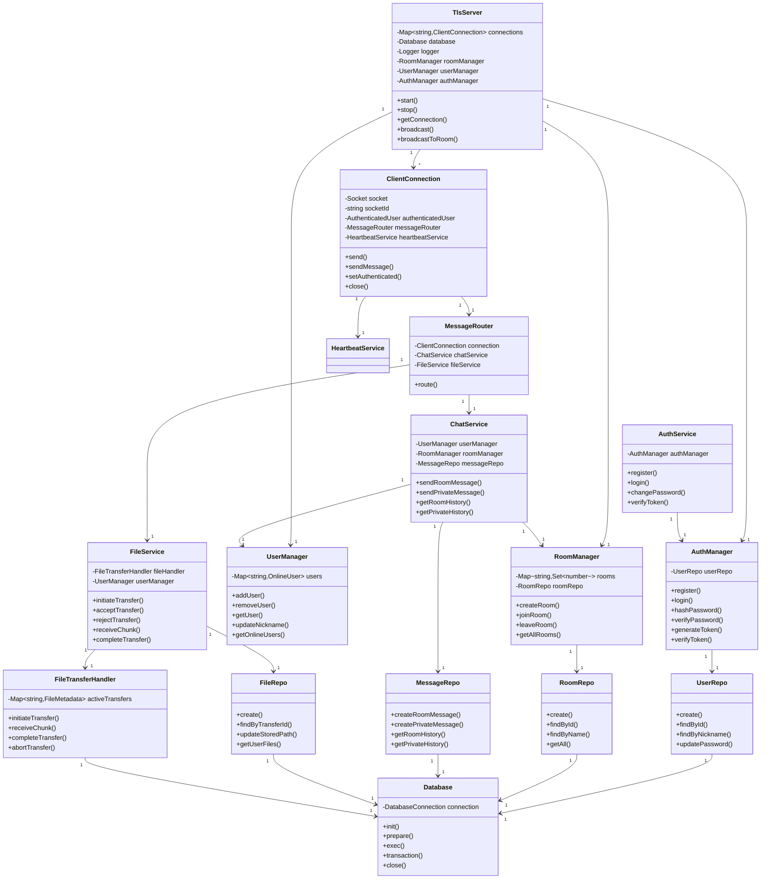

# LanChat CLI 服务端 API 文档

## 目录
- [模块概述](#模块概述)
- [分层架构](#分层架构)
- [核心类 API](#核心类-api)
  - [TlsServer](#tlsserver)
  - [ClientConnection](#clientconnection)
  - [MessageRouter](#messagerouter)
  - [AuthManager](#authmanager)
  - [UserManager](#usermanager)
  - [RoomManager](#roommanager)
  - [FileTransferHandler](#filetransferhandler)
  - [HeartbeatService](#heartbeatservice)
  - [Database](#database)
- [服务层文档](#服务层文档)
  - [AuthService](#authservice)
  - [ChatService](#chatservice)
  - [FileService](#fileservice)
- [数据访问层文档](#数据访问层文档)
  - [UserRepo](#userrepo)
  - [RoomRepo](#roomrepo)
  - [MessageRepo](#messagerepo)
  - [FileRepo](#filerepo)
- [使用示例](#使用示例)
- [部署指南](#部署指南)
- [架构图](#架构图)

---

## 模块概述

LanChat CLI 服务端是一个基于 Node.js 的聊天服务器应用程序，支持以下功能：

- 用户认证（登录、注册、密码修改）
- 聊天室管理（创建、加入、离开）
- 群聊和私聊消息
- 文件传输（支持大文件分块传输）
- 心跳检测和连接管理
- 安全的 TLS 加密通信
- SQLite 数据持久化

### 技术栈
- TypeScript
- Node.js
- SQLite (better-sqlite3)
- TLS/SSL（安全传输）
- JWT（身份认证）
- Argon2（密码加密）
- Winston（日志记录）
- 事件驱动架构

---

## 分层架构

服务端采用清晰的分层架构设计：

### 1. 数据访问层（Repository Layer）
负责数据持久化操作，直接与数据库交互
- `UserRepo`：用户数据访问
- `RoomRepo`：房间数据访问
- `MessageRepo`：消息数据访问
- `FileRepo`：文件记录数据访问

### 2. 业务逻辑层（Manager Layer）
负责核心业务逻辑处理
- `AuthManager`：认证业务逻辑
- `UserManager`：在线用户管理
- `RoomManager`：房间管理
- `FileTransferHandler`：文件传输处理

### 3. 核心服务层（Service Layer）
提供高级服务接口
- `AuthService`：认证服务
- `ChatService`：聊天服务
- `FileService`：文件服务

### 4. 连接与路由层
负责连接管理和消息路由
- `TlsServer`：服务器入口
- `ClientConnection`：客户端连接管理
- `MessageRouter`：消息路由分发
- `HeartbeatService`：心跳服务

---

## 核心类 API

### TlsServer

TLS 加密聊天服务器主类，负责接受连接、管理客户端和广播消息。

#### 构造函数

```typescript
constructor(database: Database, logger: Logger)
```

**参数：**
- `database` - 数据库实例
- `logger` - Winston 日志记录器

#### 属性

| 属性 | 类型 | 说明 |
|------|------|------|
| `connections` | `Map<string, ClientConnection>` | 当前连接的客户端映射 |
| `database` | `Database` | 数据库实例 |
| `logger` | `Logger` | 日志记录器 |
| `roomManager` | `RoomManager` | 房间管理器 |
| `userManager` | `UserManager` | 用户管理器 |
| `authManager` | `AuthManager` | 认证管理器 |

#### 方法

##### start
```typescript
async start(): Promise<void>
```

启动 TLS 服务器，监听指定端口。

**示例：**
```typescript
const server = new TlsServer(database, logger);
await server.start();
```

##### stop
```typescript
async stop(): Promise<void>
```

停止服务器，关闭所有连接。

##### getConnection
```typescript
getConnection(socketId: string): ClientConnection | undefined
```

获取指定 socket ID 的连接。

**参数：**
- `socketId` - 套接字标识符

**返回：** 客户端连接实例或 undefined

##### getAllConnections
```typescript
getAllConnections(): Map<string, ClientConnection>
```

获取所有当前连接。

**返回：** 客户端连接映射的副本

##### getRoomManager
```typescript
getRoomManager(): RoomManager
```

获取房间管理器实例。

**返回：** 房间管理器

##### getUserManager
```typescript
getUserManager(): UserManager
```

获取用户管理器实例。

**返回：** 用户管理器

##### getAuthManager
```typescript
getAuthManager(): AuthManager
```

获取认证管理器实例。

**返回：** 认证管理器

##### broadcast
```typescript
broadcast(message: Buffer, excludeSocketIds?: string[]): void
```

向所有连接广播消息。

**参数：**
- `message` - 要广播的消息缓冲区
- `excludeSocketIds` - 可选，要排除的 socket ID 数组

##### broadcastToRoom
```typescript
broadcastToRoom(roomName: string, message: Buffer, excludeSocketIds?: string[]): void
```

向指定房间的所有用户广播消息。

**参数：**
- `roomName` - 房间名称
- `message` - 要广播的消息缓冲区
- `excludeSocketIds` - 可选，要排除的 socket ID 数组

**示例：**
```typescript
const message = MessageCodec.encodeJson(MessageType.CHAT_ROOM, chatData);
server.broadcastToRoom('#general', message, [senderSocketId]);
```

---

### ClientConnection

客户端连接管理类，处理单个客户端的通信、认证和清理。

#### 构造函数

```typescript
constructor(
  socket: Socket,
  socketId: string,
  database: Database,
  logger: Logger,
  server: TlsServer,
  authManager: AuthManager,
  userManager: UserManager,
  roomManager: RoomManager
)
```

**参数：**
- `socket` - TCP/TLS 套接字
- `socketId` - 套接字标识符
- `database` - 数据库实例
- `logger` - 日志记录器
- `server` - TlsServer 实例
- `authManager` - 认证管理器
- `userManager` - 用户管理器
- `roomManager` - 房间管理器

#### 属性

| 属性 | 类型 | 说明 |
|------|------|------|
| `socketId` | `string` | 套接字标识符 |
| `authenticatedUser` | `AuthenticatedUser \| null` | 认证的用户信息 |
| `isAlive` | `boolean` | 连接是否活跃 |

#### 方法

##### send
```typescript
send(buffer: Buffer): void
```

发送原始二进制数据。

**参数：**
- `buffer` - 数据缓冲区

##### sendMessage
```typescript
sendMessage(type: MessageType, payload: object): void
```

发送编码后的消息。

**参数：**
- `type` - 消息类型
- `payload` - 消息负载对象

**示例：**
```typescript
connection.sendMessage(MessageType.CHAT_ROOM, {
  room: '#general',
  sender: 'user1',
  text: 'Hello!',
  timestamp: new Date().toISOString()
});
```

##### sendError
```typescript
sendError(code: string, message: string): void
```

发送错误消息。

**参数：**
- `code` - 错误代码
- `message` - 错误信息

##### setAuthenticated
```typescript
setAuthenticated(user: AuthenticatedUser): void
```

设置用户认证状态。

**参数：**
- `user` - 认证的用户信息

##### getAuthenticatedUser
```typescript
getAuthenticatedUser(): AuthenticatedUser | null
```

获取当前认证的用户。

**返回：** 认证用户信息或 null

##### getSocketId
```typescript
getSocketId(): string
```

获取套接字 ID。

**返回：** 套接字标识符

##### resetHeartbeatTimeout
```typescript
resetHeartbeatTimeout(): void
```

重置心跳超时定时器。

##### close
```typescript
close(): void
```

关闭连接并清理资源。

#### 事件

| 事件名 | 参数 | 说明 |
|--------|------|------|
| `close` | - | 连接关闭 |

---

### MessageRouter

消息路由器，负责根据消息类型分发到相应的处理函数。

#### 构造函数

```typescript
constructor(
  connection: ClientConnection,
  database: Database,
  authManager: AuthManager,
  userManager: UserManager,
  roomManager: RoomManager,
  server: TlsServer,
  logger: Logger
)
```

**参数：**
- `connection` - 客户端连接
- `database` - 数据库实例
- `authManager` - 认证管理器
- `userManager` - 用户管理器
- `roomManager` - 房间管理器
- `server` - TlsServer 实例
- `logger` - 日志记录器

#### 方法

##### route
```typescript
route(
  socketId: string,
  user: AuthenticatedUser | null,
  type: MessageType,
  payload: Buffer
): void
```

路由消息到相应的处理函数。

**参数：**
- `socketId` - 套接字 ID
- `user` - 认证用户（可能为 null）
- `type` - 消息类型
- `payload` - 消息负载

**示例：**
```typescript
router.route(socketId, user, MessageType.CHAT_ROOM, payload);
```

---

### AuthManager

认证管理器，负责用户注册、登录、密码加密和令牌生成。

#### 构造函数

```typescript
constructor(database: Database)
```

**参数：**
- `database` - 数据库实例

#### 方法

##### register
```typescript
async register(request: RegisterRequest): Promise<void>
```

注册新用户。

**参数：**
- `request` - 注册请求对象
  - `nickname` - 用户昵称
  - `password` - 用户密码

**抛出：**
- `ValidationError` - 昵称或密码为空
- `AuthError` - 昵称已被占用

**示例：**
```typescript
await authManager.register({
  nickname: 'newuser',
  password: 'securepassword123'
});
```

##### login
```typescript
async login(request: LoginRequest): Promise<AuthenticatedUser>
```

用户登录。

**参数：**
- `request` - 登录请求对象
  - `nickname` - 用户昵称
  - `password` - 用户密码

**返回：** 认证用户信息，包含 JWT 令牌

**抛出：**
- `ValidationError` - 昵称或密码为空
- `AuthError` - 用户不存在或密码错误

**示例：**
```typescript
const user = await authManager.login({
  nickname: 'user1',
  password: 'password123'
});
```

##### hashPassword
```typescript
async hashPassword(password: string): Promise<string>
```

使用 Argon2 加密密码。

**参数：**
- `password` - 明文密码

**返回：** 加密后的密码哈希

##### verifyPassword
```typescript
async verifyPassword(password: string, hash: string): Promise<boolean>
```

验证密码是否匹配。

**参数：**
- `password` - 明文密码
- `hash` - 密码哈希

**返回：** 如果匹配返回 true

##### generateToken
```typescript
generateToken(userId: number, nickname: string): string
```

生成 JWT 认证令牌。

**参数：**
- `userId` - 用户 ID
- `nickname` - 用户昵称

**返回：** JWT 令牌字符串

##### verifyToken
```typescript
verifyToken(token: string): AuthenticatedUser
```

验证并解析 JWT 令牌。

**参数：**
- `token` - JWT 令牌

**返回：** 认证用户信息

**抛出：**
- `AuthError` - 令牌无效或已过期

##### changePassword
```typescript
async changePassword(userId: number, oldPassword: string, newPassword: string): Promise<void>
```

修改用户密码。

**参数：**
- `userId` - 用户 ID
- `oldPassword` - 旧密码
- `newPassword` - 新密码

**抛出：**
- `ValidationError` - 用户不存在
- `AuthError` - 旧密码错误

---

### UserManager

在线用户管理器，管理当前连接的用户状态。

#### 构造函数

```typescript
constructor(logger: Logger)
```

**参数：**
- `logger` - 日志记录器

#### 方法

##### addUser
```typescript
addUser(socketId: string, userId: number, nickname: string): OnlineUser
```

添加在线用户。

**参数：**
- `socketId` - 套接字 ID
- `userId` - 用户 ID
- `nickname` - 用户昵称

**返回：** 在线用户对象

##### removeUser
```typescript
removeUser(socketId: string): OnlineUser | undefined
```

移除在线用户。

**参数：**
- `socketId` - 套接字 ID

**返回：** 被移除的用户对象或 undefined

##### getUser
```typescript
getUser(socketId: string): OnlineUser | undefined
```

根据 socket ID 获取用户。

**参数：**
- `socketId` - 套接字 ID

**返回：** 在线用户对象或 undefined

##### getUserByNickname
```typescript
getUserByNickname(nickname: string): OnlineUser | undefined
```

根据昵称获取用户。

**参数：**
- `nickname` - 用户昵称

**返回：** 在线用户对象或 undefined

##### updateNickname
```typescript
updateNickname(socketId: string, newNickname: string): boolean
```

更新用户昵称。

**参数：**
- `socketId` - 套接字 ID
- `newNickname` - 新昵称

**返回：** 是否更新成功

##### updateActiveRoom
```typescript
updateActiveRoom(socketId: string, room: string): boolean
```

更新用户的活跃房间。

**参数：**
- `socketId` - 套接字 ID
- `room` - 房间名称

**返回：** 是否更新成功

##### getUsersInRoom
```typescript
getUsersInRoom(room: string): OnlineUser[]
```

获取指定房间的所有用户。

**参数：**
- `room` - 房间名称

**返回：** 在线用户数组

##### getUsersInRoomSocketIds
```typescript
getUsersInRoomSocketIds(room: string): string[]
```

获取指定房间的所有用户 socket ID。

**参数：**
- `room` - 房间名称

**返回：** socket ID 数组

##### isNicknameTaken
```typescript
isNicknameTaken(nickname: string, excludeSocketId?: string): boolean
```

检查昵称是否已被占用。

**参数：**
- `nickname` - 要检查的昵称
- `excludeSocketId` - 可选，排除的 socket ID

**返回：** 如果昵称已被占用返回 true

##### getOnlineUsers
```typescript
getOnlineUsers(): OnlineUser[]
```

获取所有在线用户。

**返回：** 在线用户数组副本

##### getOnlineUserCount
```typescript
getOnlineUserCount(): number
```

获取在线用户数量。

**返回：** 用户数量

##### getOnlineUserCountInRoom
```typescript
getOnlineUserCountInRoom(room: string): number
```

获取指定房间的在线用户数量。

**参数：**
- `room` - 房间名称

**返回：** 用户数量

##### getAllSocketIds
```typescript
getAllSocketIds(): string[]
```

获取所有在线用户的 socket ID。

**返回：** socket ID 数组

##### getSocketIdByNickname
```typescript
getSocketIdByNickname(nickname: string): string | undefined
```

根据昵称获取 socket ID。

**参数：**
- `nickname` - 用户昵称

**返回：** socket ID 或 undefined

---

### RoomManager

房间管理器，管理聊天室的创建、加入、离开和成员。

#### 构造函数

```typescript
constructor(database: Database, logger: Logger)
```

**参数：**
- `database` - 数据库实例
- `logger` - 日志记录器

#### 方法

##### createRoom
```typescript
createRoom(name: string, createdBy: number): void
```

创建新房间。

**参数：**
- `name` - 房间名称
- `createdBy` - 创建者用户 ID

**抛出：**
- `ValidationError` - 房间名无效
- `AppError` - 房间已存在

**示例：**
```typescript
roomManager.createRoom('#gaming', userId);
```

##### joinRoom
```typescript
joinRoom(name: string, userId: number): void
```

用户加入房间。

**参数：**
- `name` - 房间名称
- `userId` - 用户 ID

**抛出：**
- `NotFoundError` - 房间不存在

##### leaveRoom
```typescript
leaveRoom(name: string, userId: number): void
```

用户离开房间。

**参数：**
- `name` - 房间名称
- `userId` - 用户 ID

**抛出：**
- `ValidationError` - 不能离开默认房间

##### isUserInRoom
```typescript
isUserInRoom(name: string, userId: number): boolean
```

检查用户是否在房间中。

**参数：**
- `name` - 房间名称
- `userId` - 用户 ID

**返回：** 如果用户在房间中返回 true

##### getRoomMembers
```typescript
getRoomMembers(name: string): Set<number>
```

获取房间成员的用户 ID 集合。

**参数：**
- `name` - 房间名称

**返回：** 用户 ID 集合副本

##### getRoomMemberCount
```typescript
getRoomMemberCount(name: string): number
```

获取房间成员数量。

**参数：**
- `name` - 房间名称

**返回：** 成员数量

##### getAllRooms
```typescript
getAllRooms(): RoomInfo[]
```

获取所有房间信息。

**返回：** 房间信息数组

##### getRoomName
```typescript
getRoomName(id: number): string | undefined
```

根据房间 ID 获取房间名。

**参数：**
- `id` - 房间 ID

**返回：** 房间名称或 undefined

##### getRoomId
```typescript
getRoomId(name: string): number | undefined
```

根据房间名获取房间 ID。

**参数：**
- `name` - 房间名称

**返回：** 房间 ID 或 undefined

##### getDefaultRoom
```typescript
getDefaultRoom(): string
```

获取默认房间名称。

**返回：** 默认房间名称（#general）

##### roomExists
```typescript
roomExists(name: string): boolean
```

检查房间是否存在。

**参数：**
- `name` - 房间名称

**返回：** 如果房间存在返回 true

##### removeFromDefaultRoom
```typescript
removeFromDefaultRoom(userId: number): void
```

从默认房间移除用户（用于连接断开时的清理）。

**参数：**
- `userId` - 用户 ID

---

### FileTransferHandler

文件传输处理器，管理文件传输会话和临时文件。

#### 构造函数

```typescript
constructor(database: Database, logger: Logger)
```

**参数：**
- `database` - 数据库实例
- `logger` - 日志记录器

#### 方法

##### initiateTransfer
```typescript
initiateTransfer(
  transferId: string,
  fileName: string,
  fileSize: number,
  senderId: number,
  receiverId?: number | null,
  roomId?: number | null
): FileMetadata & { senderId: number; receiverId?: number | null; roomId?: number | null }
```

初始化文件传输会话。

**参数：**
- `transferId` - 传输 ID
- `fileName` - 文件名
- `fileSize` - 文件大小（字节）
- `senderId` - 发送者用户 ID
- `receiverId` - 可选，接收者用户 ID
- `roomId` - 可选，房间 ID

**返回：** 文件元数据对象

**抛出：**
- `ValidationError` - 文件大小无效

##### receiveChunk
```typescript
receiveChunk(transferId: string, chunkIndex: number, data: Buffer): void
```

接收文件数据块。

**参数：**
- `transferId` - 传输 ID
- `chunkIndex` - 块索引
- `data` - 数据缓冲区

**抛出：**
- `Error` - 传输会话不存在或临时文件不存在

##### getProgress
```typescript
getProgress(transferId: string): number
```

获取传输进度。

**参数：**
- `transferId` - 传输 ID

**返回：** 进度百分比（0-100）

##### completeTransfer
```typescript
completeTransfer(transferId: string): string | null
```

完成文件传输，将临时文件移动到最终位置。

**参数：**
- `transferId` - 传输 ID

**返回：** 最终文件路径或 null

##### abortTransfer
```typescript
abortTransfer(transferId: string): void
```

中止文件传输，删除临时文件。

**参数：**
- `transferId` - 传输 ID

##### getTransfer
```typescript
getTransfer(transferId: string): FileMetadata | undefined
```

获取传输会话信息。

**参数：**
- `transferId` - 传输 ID

**返回：** 文件元数据或 undefined

##### isTransferComplete
```typescript
isTransferComplete(transferId: string): boolean
```

检查传输是否完成。

**参数：**
- `transferId` - 传输 ID

**返回：** 如果传输完成返回 true

##### cleanupOldTempFiles
```typescript
cleanupOldTempFiles(): void
```

清理过期的临时文件。

---

### HeartbeatService

心跳服务，定期发送心跳并检测连接状态。

#### 构造函数

```typescript
constructor(connection: ClientConnection, logger: Logger)
```

**参数：**
- `connection` - 客户端连接
- `logger` - 日志记录器

#### 方法

##### start
```typescript
start(): void
```

启动心跳服务。

##### stop
```typescript
stop(): void
```

停止心跳服务。

##### reset
```typescript
reset(): void
```

重置心跳服务。

---

### Database

数据库管理类，负责数据库初始化、表创建和数据访问。

#### 构造函数

```typescript
constructor()
```

#### 方法

##### init
```typescript
init(): void
```

初始化数据库，创建表和默认数据。

**示例：**
```typescript
const db = new Database();
db.init();
```

##### prepare
```typescript
prepare(sql: string): Statement
```

准备 SQL 语句。

**参数：**
- `sql` - SQL 语句

**返回：** 预编译语句对象

##### exec
```typescript
exec(sql: string): void
```

执行 SQL 语句。

**参数：**
- `sql` - SQL 语句

##### transaction
```typescript
transaction<T>(fn: () => T): T
```

执行事务。

**参数：**
- `fn` - 事务函数

**返回：** 事务函数的返回值

**示例：**
```typescript
db.transaction(() => {
  userRepo.create('user1', 'hash');
  roomRepo.create('#room1', 1);
});
```

##### close
```typescript
close(): void
```

关闭数据库连接。

---

## 服务层文档

### AuthService

认证服务，提供认证相关的高级接口。

#### 构造函数

```typescript
constructor(database: Database, authManager: AuthManager)
```

**参数：**
- `database` - 数据库实例
- `authManager` - 认证管理器

#### 方法

##### register
```typescript
async register(request: RegisterRequest): Promise<void>
```

注册新用户，包含验证。

**参数：**
- `request` - 注册请求对象

##### login
```typescript
async login(request: LoginRequest): Promise<AuthenticatedUser>
```

用户登录，包含验证。

**参数：**
- `request` - 登录请求对象

**返回：** 认证用户信息

##### changePassword
```typescript
async changePassword(
  userId: number,
  oldPassword: string,
  newPassword: string
): Promise<void>
```

修改用户密码，包含验证。

**参数：**
- `userId` - 用户 ID
- `oldPassword` - 旧密码
- `newPassword` - 新密码

##### verifyToken
```typescript
verifyToken(token: string): AuthenticatedUser
```

验证 JWT 令牌。

**参数：**
- `token` - JWT 令牌

**返回：** 认证用户信息

---

### ChatService

聊天服务，处理消息发送和历史记录。

#### 构造函数

```typescript
constructor(
  database: Database,
  userManager: UserManager,
  roomManager: RoomManager,
  server: TlsServer,
  logger: Logger
)
```

**参数：**
- `database` - 数据库实例
- `userManager` - 用户管理器
- `roomManager` - 房间管理器
- `server` - TlsServer 实例
- `logger` - 日志记录器

#### 方法

##### sendRoomMessage
```typescript
sendRoomMessage(
  roomName: string,
  senderId: number,
  senderNickname: string,
  content: string
): number
```

发送房间消息并广播。

**参数：**
- `roomName` - 房间名称
- `senderId` - 发送者用户 ID
- `senderNickname` - 发送者昵称
- `content` - 消息内容

**返回：** 消息 ID

**示例：**
```typescript
chatService.sendRoomMessage(
  '#general',
  1,
  'user1',
  'Hello everyone!'
);
```

##### sendPrivateMessage
```typescript
sendPrivateMessage(
  senderId: number,
  senderNickname: string,
  targetNickname: string,
  content: string
): number
```

发送私聊消息。

**参数：**
- `senderId` - 发送者用户 ID
- `senderNickname` - 发送者昵称
- `targetNickname` - 目标用户昵称
- `content` - 消息内容

**返回：** 消息 ID

**抛出：**
- `ValidationError` - 目标用户不在线

##### getRoomHistory
```typescript
getRoomHistory(roomName: string, count: number = DEFAULT_HISTORY_COUNT): HistoryMessage[]
```

获取房间历史消息。

**参数：**
- `roomName` - 房间名称
- `count` - 消息数量（默认 50）

**返回：** 历史消息数组

**抛出：**
- `ValidationError` - 房间不存在

##### getPrivateHistory
```typescript
getPrivateHistory(
  currentUserId: number,
  targetNickname: string,
  count: number = DEFAULT_HISTORY_COUNT
): HistoryMessage[]
```

获取私聊历史消息。

**参数：**
- `currentUserId` - 当前用户 ID
- `targetNickname` - 目标用户昵称
- `count` - 消息数量（默认 50）

**返回：** 历史消息数组

**抛出：**
- `ValidationError` - 目标用户不存在

##### sendSystemMessage
```typescript
sendSystemMessage(roomName: string, content: string): void
```

发送系统消息到房间。

**参数：**
- `roomName` - 房间名称
- `content` - 消息内容

---

### FileService

文件服务，管理文件传输的高级操作。

#### 构造函数

```typescript
constructor(
  database: Database,
  userManager: UserManager,
  logger: Logger
)
```

**参数：**
- `database` - 数据库实例
- `userManager` - 用户管理器
- `logger` - 日志记录器

#### 方法

##### initiateTransfer
```typescript
initiateTransfer(
  request: FileRequestPayload,
  senderId: number
): FileTransferSession
```

初始化文件传输。

**参数：**
- `request` - 文件传输请求
  - `fileName` - 文件名
  - `fileSize` - 文件大小
  - `targetUser` - 可选，目标用户昵称
  - `room` - 可选，房间名称
- `senderId` - 发送者用户 ID

**返回：** 文件传输会话对象

**抛出：**
- `ValidationError` - 文件大小无效
- `NotFoundError` - 目标用户或房间不存在

##### acceptTransfer
```typescript
acceptTransfer(transferId: string, receiverId: number): void
```

接受文件传输。

**参数：**
- `transferId` - 传输 ID
- `receiverId` - 接收者用户 ID

**抛出：**
- `ValidationError` - 传输会话不存在或不是接收者

##### rejectTransfer
```typescript
rejectTransfer(transferId: string, receiverId: number, reason?: string): void
```

拒绝文件传输。

**参数：**
- `transferId` - 传输 ID
- `receiverId` - 接收者用户 ID
- `reason` - 可选，拒绝原因

**抛出：**
- `ValidationError` - 传输会话不存在或不是接收者

##### receiveChunk
```typescript
receiveChunk(transferId: string, chunkIndex: number, data: Buffer): void
```

接收文件数据块。

**参数：**
- `transferId` - 传输 ID
- `chunkIndex` - 块索引
- `data` - 数据缓冲区

##### completeTransfer
```typescript
completeTransfer(transferId: string): string
```

完成文件传输。

**参数：**
- `transferId` - 传输 ID

**返回：** 存储文件路径

**抛出：**
- `ValidationError` - 传输会话不存在

##### abortTransfer
```typescript
abortTransfer(transferId: string, reason?: string): void
```

中止文件传输。

**参数：**
- `transferId` - 传输 ID
- `reason` - 可选，中止原因

##### getSession
```typescript
getSession(transferId: string): FileTransferSession | undefined
```

获取传输会话。

**参数：**
- `transferId` - 传输 ID

**返回：** 传输会话对象或 undefined

##### getProgress
```typescript
getProgress(transferId: string): number
```

获取传输进度。

**参数：**
- `transferId` - 传输 ID

**返回：** 进度百分比（0-100）

##### isTransferComplete
```typescript
isTransferComplete(transferId: string): boolean
```

检查传输是否完成。

**参数：**
- `transferId` - 传输 ID

**返回：** 如果完成返回 true

---

## 数据访问层文档

### UserRepo

用户数据访问对象。

#### 构造函数

```typescript
constructor(database: Database)
```

**参数：**
- `database` - 数据库实例

#### 方法

##### create
```typescript
create(nickname: string, hashedPassword: string): number
```

创建新用户。

**参数：**
- `nickname` - 用户昵称
- `hashedPassword` - 加密后的密码

**返回：** 用户 ID

##### findById
```typescript
findById(id: number): User | undefined
```

根据 ID 查找用户。

**参数：**
- `id` - 用户 ID

**返回：** 用户对象或 undefined

##### findByNickname
```typescript
findByNickname(nickname: string): User | undefined
```

根据昵称查找用户。

**参数：**
- `nickname` - 用户昵称

**返回：** 用户对象或 undefined

##### updatePassword
```typescript
updatePassword(id: number, hashedPassword: string): void
```

更新用户密码。

**参数：**
- `id` - 用户 ID
- `hashedPassword` - 新的加密密码

##### delete
```typescript
delete(id: number): void
```

删除用户。

**参数：**
- `id` - 用户 ID

##### exists
```typescript
exists(nickname: string): boolean
```

检查用户是否存在。

**参数：**
- `nickname` - 用户昵称

**返回：** 如果存在返回 true

##### getAll
```typescript
getAll(): User[]
```

获取所有用户。

**返回：** 用户数组

---

### RoomRepo

房间数据访问对象。

#### 构造函数

```typescript
constructor(database: Database)
```

**参数：**
- `database` - 数据库实例

#### 方法

##### create
```typescript
create(name: string, createdBy: number | null): number
```

创建新房间。

**参数：**
- `name` - 房间名称
- `createdBy` - 创建者用户 ID（可为 null）

**返回：** 房间 ID

##### findById
```typescript
findById(id: number): Room | undefined
```

根据 ID 查找房间。

**参数：**
- `id` - 房间 ID

**返回：** 房间对象或 undefined

##### findByName
```typescript
findByName(name: string): Room | undefined
```

根据名称查找房间。

**参数：**
- `name` - 房间名称

**返回：** 房间对象或 undefined

##### update
```typescript
update(id: number, updates: Partial<Pick<Room, 'name' | 'is_default'>>): void
```

更新房间信息。

**参数：**
- `id` - 房间 ID
- `updates` - 更新字段

##### delete
```typescript
delete(name: string): void
```

删除房间（仅非默认房间）。

**参数：**
- `name` - 房间名称

##### exists
```typescript
exists(name: string): boolean
```

检查房间是否存在。

**参数：**
- `name` - 房间名称

**返回：** 如果存在返回 true

##### isDefault
```typescript
isDefault(id: number): boolean
```

检查是否为默认房间。

**参数：**
- `id` - 房间 ID

**返回：** 如果是默认房间返回 true

##### getAll
```typescript
getAll(): Room[]
```

获取所有房间。

**返回：** 房间数组

---

### MessageRepo

消息数据访问对象。

#### 构造函数

```typescript
constructor(database: Database)
```

**参数：**
- `database` - 数据库实例

#### 方法

##### createRoomMessage
```typescript
createRoomMessage(
  roomId: number,
  senderId: number,
  content: string,
  type: string = 'chat'
): number
```

创建房间消息。

**参数：**
- `roomId` - 房间 ID
- `senderId` - 发送者用户 ID
- `content` - 消息内容
- `type` - 消息类型（默认 'chat'）

**返回：** 消息 ID

##### createPrivateMessage
```typescript
createPrivateMessage(
  senderId: number,
  receiverId: number,
  content: string
): number
```

创建私聊消息。

**参数：**
- `senderId` - 发送者用户 ID
- `receiverId` - 接收者用户 ID
- `content` - 消息内容

**返回：** 消息 ID

##### getRoomHistory
```typescript
getRoomHistory(
  roomId: number,
  limit: number = DEFAULT_HISTORY_COUNT,
  offset: number = 0
): MessageWithSender[]
```

获取房间历史消息。

**参数：**
- `roomId` - 房间 ID
- `limit` - 消息数量
- `offset` - 偏移量

**返回：** 带发送者信息的消息数组

##### getPrivateHistory
```typescript
getPrivateHistory(
  userId1: number,
  userId2: number,
  limit: number = DEFAULT_HISTORY_COUNT,
  offset: number = 0
): Array<Message & { sender_nickname: string; receiver_nickname: string }>
```

获取私聊历史消息。

**参数：**
- `userId1` - 用户 1 ID
- `userId2` - 用户 2 ID
- `limit` - 消息数量
- `offset` - 偏移量

**返回：** 带发送者和接收者信息的消息数组

##### getMessageById
```typescript
getMessageById(id: number): Message | undefined
```

根据 ID 获取消息。

**参数：**
- `id` - 消息 ID

**返回：** 消息对象或 undefined

##### deleteOldMessages
```typescript
deleteOldMessages(roomId: number, keepCount: number): number
```

删除旧消息。

**参数：**
- `roomId` - 房间 ID
- `keepCount` - 保留的消息数量

**返回：** 删除的消息数量

---

### FileRepo

文件记录数据访问对象。

#### 构造函数

```typescript
constructor(database: Database)
```

**参数：**
- `database` - 数据库实例

#### 方法

##### create
```typescript
create(record: CreateFileRecord): number
```

创建文件记录。

**参数：**
- `record` - 文件记录对象
  - `transferId` - 传输 ID
  - `senderId` - 发送者用户 ID
  - `receiverId` - 可选，接收者用户 ID
  - `roomId` - 可选，房间 ID
  - `fileName` - 文件名
  - `fileSize` - 文件大小
  - `storedPath` - 可选，存储路径

**返回：** 记录 ID

##### findByTransferId
```typescript
findByTransferId(transferId: string): FileRecord | undefined
```

根据传输 ID 查找文件记录。

**参数：**
- `transferId` - 传输 ID

**返回：** 文件记录或 undefined

##### updateStoredPath
```typescript
updateStoredPath(transferId: string, storedPath: string): void
```

更新文件存储路径。

**参数：**
- `transferId` - 传输 ID
- `storedPath` - 存储路径

##### getUserFiles
```typescript
getUserFiles(userId: number, limit: number = 50): FileRecord[]
```

获取用户的文件记录。

**参数：**
- `userId` - 用户 ID
- `limit` - 记录数量

**返回：** 文件记录数组

##### getRoomFiles
```typescript
getRoomFiles(roomId: number, limit: number = 50): FileRecord[]
```

获取房间的文件记录。

**参数：**
- `roomId` - 房间 ID
- `limit` - 记录数量

**返回：** 文件记录数组

##### delete
```typescript
delete(transferId: string): void
```

删除文件记录。

**参数：**
- `transferId` - 传输 ID

##### getAll
```typescript
getAll(limit: number = 100): FileRecord[]
```

获取所有文件记录。

**参数：**
- `limit` - 记录数量

**返回：** 文件记录数组

---

## 使用示例

### 启动服务器

```typescript
import { Database } from './server/Database';
import { TlsServer } from './server/TlsServer';
import winston from 'winston';

// 配置日志
const logger = winston.createLogger({
  level: 'info',
  format: winston.format.json(),
  transports: [new winston.transports.Console()]
});

// 初始化数据库
const database = new Database();
database.init();

// 创建并启动服务器
const server = new TlsServer(database, logger);

async function main() {
  try {
    await server.start();
    logger.info('服务器启动成功');
    
    // 优雅关闭
    process.on('SIGINT', async () => {
      logger.info('正在关闭服务器...');
      await server.stop();
      database.close();
      process.exit(0);
    });
  } catch (error) {
    logger.error('服务器启动失败', { error });
    process.exit(1);
  }
}

main();
```

### 使用认证管理器

```typescript
import { Database } from './server/Database';
import { AuthManager } from './server/AuthManager';

const database = new Database();
database.init();
const authManager = new AuthManager(database);

// 注册用户
async function registerExample() {
  try {
    await authManager.register({
      nickname: 'alice',
      password: 'SecurePass123!'
    });
    console.log('注册成功');
  } catch (error) {
    console.error('注册失败:', error.message);
  }
}

// 用户登录
async function loginExample() {
  try {
    const user = await authManager.login({
      nickname: 'alice',
      password: 'SecurePass123!'
    });
    console.log('登录成功:', user);
    return user;
  } catch (error) {
    console.error('登录失败:', error.message);
  }
}

// 验证令牌
function verifyTokenExample(token: string) {
  try {
    const user = authManager.verifyToken(token);
    console.log('令牌验证成功:', user);
    return user;
  } catch (error) {
    console.error('令牌验证失败:', error.message);
  }
}
```

### 使用房间和用户管理器

```typescript
import { Database } from './server/Database';
import { RoomManager } from './server/RoomManager';
import { UserManager } from './server/UserManager';
import winston from 'winston';

const logger = winston.createLogger({ transports: [new winston.transports.Console()] });
const database = new Database();
database.init();

const roomManager = new RoomManager(database, logger);
const userManager = new UserManager(logger);

// 创建房间
roomManager.createRoom('#gaming', 1);

// 添加用户
const user = userManager.addUser('socket-123', 1, 'alice');
userManager.updateActiveRoom('socket-123', '#gaming');

// 用户加入房间
roomManager.joinRoom('#gaming', 1);

// 获取房间用户
const users = userManager.getUsersInRoom('#gaming');
console.log('房间用户:', users);

// 获取所有房间
const rooms = roomManager.getAllRooms();
console.log('所有房间:', rooms);
```

### 使用聊天服务

```typescript
import { Database } from './server/Database';
import { UserManager } from './server/UserManager';
import { RoomManager } from './server/RoomManager';
import { TlsServer } from './server/TlsServer';
import { ChatService } from './server/services/ChatService';
import winston from 'winston';

const logger = winston.createLogger({ transports: [new winston.transports.Console()] });
const database = new Database();
database.init();

const roomManager = new RoomManager(database, logger);
const userManager = new UserManager(logger);
const server = new TlsServer(database, logger);

const chatService = new ChatService(
  database,
  userManager,
  roomManager,
  server,
  logger
);

// 发送房间消息
chatService.sendRoomMessage(
  '#general',
  1,
  'alice',
  'Hello everyone!'
);

// 获取历史消息
const history = chatService.getRoomHistory('#general', 100);
console.log('历史消息:', history);
```

### 使用文件服务

```typescript
import { Database } from './server/Database';
import { UserManager } from './server/UserManager';
import { FileService } from './server/services/FileService';
import winston from 'winston';

const logger = winston.createLogger({ transports: [new winston.transports.Console()] });
const database = new Database();
database.init();

const userManager = new UserManager(logger);
const fileService = new FileService(database, userManager, logger);

// 初始化文件传输
const session = fileService.initiateTransfer(
  {
    fileName: 'document.pdf',
    fileSize: 1024 * 1024, // 1MB
    targetUser: 'bob'
  },
  1 // senderId
);

console.log('传输会话:', session);

// 接受传输
fileService.acceptTransfer(session.transferId, 2); // receiverId

// 接收数据块
const chunkData = Buffer.from('...'); // 文件数据块
fileService.receiveChunk(session.transferId, 0, chunkData);

// 检查进度
const progress = fileService.getProgress(session.transferId);
console.log('传输进度:', progress + '%');

// 完成传输
const storedPath = fileService.completeTransfer(session.transferId);
console.log('文件存储在:', storedPath);
```

---

## 部署指南

### 环境要求

- Node.js 18+
- npm 或 yarn
- 有效的 TLS 证书和密钥

### 安装依赖

```bash
cd d:\code\TypeScript\LanChat-CLI
npm install
```

### 配置

1. 创建 TLS 证书

```bash
# 生成自签名证书（用于开发）
cd certs
openssl req -x509 -newkey rsa:4096 -keyout server.key -out server.crt -days 365 -nodes
```

2. 环境变量（可选）

创建 `.env` 文件：

```env
SERVER_PORT=9527
DB_PATH=./data/lanchat.db
FILES_DIR=./files
JWT_SECRET=your-secret-key-here
JWT_EXPIRES_IN=7d
```

### 构建

```bash
npm run build:server
```

### 启动服务器

```bash
npm run start:server
```

### 使用 PM2 进程管理（生产环境）

```bash
# 安装 PM2
npm install -g pm2

# 启动服务
pm2 start dist/server/index.js --name lanchat-server

# 查看状态
pm2 status

# 查看日志
pm2 logs lanchat-server

# 停止服务
pm2 stop lanchat-server
```

### 目录结构

部署后的目录结构：

```
LanChat-CLI/
├── certs/
│   ├── server.crt
│   └── server.key
├── data/
│   └── lanchat.db
├── files/
│   └── temp/
├── dist/
│   └── server/
└── logs/
```

### 安全建议

1. **使用正规 CA 签发的证书**，不要在生产环境使用自签名证书
2. **定期更换 JWT 密钥**
3. **配置防火墙**，只开放必要的端口
4. **启用日志监控**，及时发现异常
5. **定期备份数据库**
6. **限制文件传输大小**（默认最大 500MB）
7. **配置 TLS 最低版本为 1.2+**

### 性能优化

1. 使用 SSD 存储数据库
2. 配置合适的 WAL 模式（已启用）
3. 定期清理过期临时文件
4. 监控内存使用，及时重启服务

---

## 架构图

### 整体架构图



### 分层架构图



### 消息流程图



### 类关系图



---

## 更新日志

### v1.0.0
- 初始版本发布
- 实现核心聊天功能
- 支持用户认证
- 支持房间管理
- 支持文件传输
- 实现心跳检测
- 支持 TLS 加密
- SQLite 数据持久化
